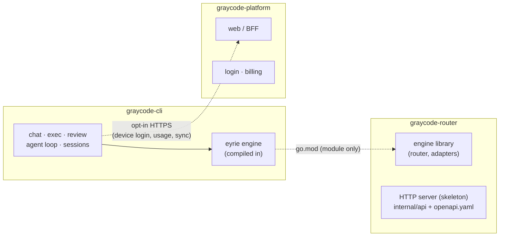
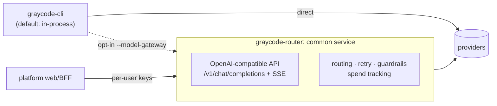

# Three-repo architecture: CLI · Router · Platform

Status: current state verified against code (2026-09-04); target state is a
proposal. See also `gateway-architecture.md` (human-readable version),
`ECOSYSTEM-WIRING.md` (pre-migration wiring, partially stale).

## Current state (verified)

Wires, with evidence:

| From → To | Mechanism | Evidence |
|---|---|---|
| CLI → Router | Go module dep, in-process construction | `go.mod` requires `github.com/GrayCodeAI/eyrie`; `internal/provider/gateway/gateway.go` is the sole importer |
| CLI → Platform | Opt-in HTTPS (login, usage, graph sync) | `internal/platform/cloud/client.go`; `Enabled()` requires endpoint + token; no default URL |
| Router → CLI | none | router `go.mod`/`go.sum` contain zero graycode-cli refs |
| Router ↔ Platform | none | no imports, package deps, or API calls either direction |

## Target state (proposal)

Rules: CLI always works alone; streams pass through byte-transparent;
auth fails fast with a login hint; CLI pins a gateway API version.

## Open items

- Gateway endpoints don't exist yet (`server.go` is a skeleton).
- Plugin registry index has no live home (both old and new URLs 404).
- `Y0_MARKETPLACE` default disagrees between code (on) and old docs (off).
- Remaining architecture prose still describes the pre-migration ecosystem.
