# `internal/intelligence/repomap/`

> Deep code-analysis engine for graycode: language-aware symbol extraction,
> static analysis, search, quality signals, API scanning, and incremental
> indexing. Distinct from `internal/context/repomap`, which is the narrow
> prompt-injection shim used by the context layer.

## What it does

`Generate(dir, opts)` walks a directory, dispatches each supported source
file to a language-aware parser, and returns a `RepoMap`: a token-budgeted
summary of files and their top-level symbols suitable for injection into
LLM prompts. Around that core the package accumulates a large set of
specialised analyses - call graph, import graph, type hierarchy, code
ownership, BM25 search, cyclomatic complexity, code smells, dead-code
detection, health score, doc linter, migration detector, HTTP route
scanner, and an incremental file-hash cache - that all share the same
parsed-symbol substrate.

The package is stdlib-only at its core (`go/parser`, `go/ast`, `go/token`,
`encoding/*`). The only third-party dependency is `github.com/fsnotify
/fsnotify` for file watching; graycode's `internal/scoring` and
`internal/ui/icons` are pulled in where they are used. Tree-sitter is
deliberately not required: Go is parsed with `go/ast` and other languages
are handled by an enhanced regex extractor with scope tracking.

## Architecture

```mermaid
flowchart TB
    subgraph Entry["Entry point"]
        REPOMAP[repomap.go<br/>Generate, RepoMap, Options]
    end

    subgraph Core["Core"]
        CACHE[cache.go<br/>in-process LRU]
        WATCHER[watcher.go<br/>fsnotify wrapper]
        GITIGNORE[gitignore.go<br/>composed rules]
        PATTERNS[patterns.go<br/>include/exclude loader]
    end

    subgraph Symbols["Symbols / parsing"]
        PARSER[parser.go<br/>regex-Go]
        ENHANCED[parser_enhanced.go<br/>AST-Go]
        LANGS[parser_langs.go<br/>regex non-Go]
        TS[treesitter.go<br/>scope-aware]
    end

    subgraph Static["Static analysis"]
        CALL[callgraph.go]
        DEP[depgraph.go]
        IMP[imports.go]
        HIER[hierarchy.go]
        IFACE[interface_extract.go]
        COCHG[cochange.go]
        CHG[changeset.go]
        OWN[ownership.go]
        SHAP[shapley.go]
    end

    subgraph Search["Search / navigation"]
        NAV[navigation.go]
        SEM[semantic.go]
        SEMSRCH[semantic_search.go]
        RERANK[rerank.go]
        PR[pagerank.go]
        PRED[predict.go]
    end

    subgraph Quality["Quality signals"]
        CPLX[complexity.go]
        SMELL[smells.go]
        HEALTH[health_score.go]
        DOC[doclint.go]
        DEAD[dead_code.go]
        MIG[migration_detector.go]
    end

    subgraph API["API surface"]
        SCAN[api_scanner.go]
    end

    subgraph Incr["Incremental"]
        INCR[incremental.go]
        INCRM[incremental_map.go]
    end

    subgraph Group["Grouping"]
        GROUPER[file_grouper.go]
        SUMMARY[summary.go]
    end

    REPOMAP --> CACHE
    REPOMAP --> WATCHER
    REPOMAP --> GITIGNORE
    REPOMAP --> PATTERNS
    REPOMAP --> PARSER
    REPOMAP --> ENHANCED
    REPOMAP --> LANGS
    REPOMAP --> TS
    Static --> IMP
    Static --> CALL
    Search --> PR
    Search --> SEM
    Search --> SEMSRCH
    Quality --> CPLX
    Quality --> SMELL
    Quality --> HEALTH
    Quality --> DOC
    Quality --> DEAD
    Quality --> MIG
    API --> SCAN
    Incr --> INCR
    Incr --> INCRM
    Group --> GROUPER
    Group --> SUMMARY
```

## File groups

| Group                  | Files                                                                                                              | Purpose                                                                                         |
|------------------------|--------------------------------------------------------------------------------------------------------------------|-------------------------------------------------------------------------------------------------|
| **Core**               | `repomap.go`, `cache.go`, `watcher.go`, `gitignore.go`, `patterns.go`                                              | Entry point, file scanning, file watching, in-process and persistent caches                      |
| **Symbols / parsing**  | `parser.go`, `parser_enhanced.go`, `parser_langs.go`, `treesitter.go`                                              | Language-aware symbol extraction: regex Go, AST Go, regex non-Go, scope-aware (tree-sitter-like) |
| **Static analysis**    | `callgraph.go`, `depgraph.go`, `imports.go`, `hierarchy.go`, `interface_extract.go`, `cochange.go`, `changeset.go`, `ownership.go`, `shapley.go` | Callers/callees, package-level deps, import graph, type hierarchy, exported surface, git-history co-change, change-set context, ownership, Shapley value ranker |
| **Search / navigation**| `navigation.go`, `semantic.go`, `semantic_search.go`, `rerank.go`, `pagerank.go`, `predict.go`                      | LSP-free navigation index, BM25 search, PageRank ranking, reranking, relevance prediction        |
| **Quality signals**    | `complexity.go`, `smells.go`, `health_score.go`, `doclint.go`, `dead_code.go`, `migration_detector.go`              | Cyclomatic complexity, code smells, health rollup, doc linter, dead code, deprecated-API detection |
| **API surface**        | `api_scanner.go`                                                                                                   | HTTP route scanners (Chi, net/http, Gin, Echo, Gorilla, Fiber) + OpenAPI export                 |
| **Incremental**        | `incremental.go`, `incremental_map.go`                                                                             | `CodeIndexer` interface and reindex loop, persistent on-disk symbol cache                       |
| **Grouping**           | `file_grouper.go`, `summary.go`                                                                                    | File grouping, codebase summary suitable for prompt injection                                    |

## Entry points

The full public surface is read from the source. The headline entry points
are:

- **`Generate(dir string, opts Options) (*RepoMap, error)`** in `repomap.go` -
  the canonical entry point. Walks `dir`, parses every supported file,
  and returns a `RepoMap` with `Files` and a `TokenEst`.
- **`(*RepoMap).Format(maxTokens int) string`** in `repomap.go` - renders
  the map as text, truncating to fit `maxTokens`.
- **`BuildCallGraph(root string) (*CallGraph, error)`** in `callgraph.go` -
  Go-only caller/callee graph from `go/ast`.
- **`BuildDepGraph` / `NewDepGraph` / `BuildFromGoMod` / `BuildFromPackageJSON`**
  in `depgraph.go` - Go and JS/TS dependency graphs.
- **`BuildImportGraph(root string) (*ImportGraph, error)`** in `imports.go` -
  file-level import graph.
- **`NewNavIndex` / `(*NavIndex).BuildIndex` / `(*NavIndex).GoToDefinition` /
  `(*NavIndex).FindReferences` / `(*NavIndex).FindImplementations`** in
  `navigation.go` - the LSP-free navigation API.
- **`BuildSemanticIndex` / `(*SemanticIndex).Search` /
  `NewSemanticSearchIndex`** in `semantic.go` / `semantic_search.go` -
  chunked TF-IDF and BM25 search.
- **`BuildSymbolGraph` / `(*SymbolGraph).TopSymbols`** in `pagerank.go` -
  symbol-level PageRank.
- **`NewComplexityAnalyzer` / `(*ComplexityAnalyzer).FindHotspots`** in
  `complexity.go` - complexity hotspots.
- **`NewSmellDetector` / `(*SmellDetector).ScanDirectory`** in `smells.go`
  - code smell detection.
- **`NewHealthScorer` / `(*HealthScorer).Score` / `FormatScore` /
  `CompareScores`** in `health_score.go` - health score rollup and
  before/after diff.
- **`NewDeadCodeDetector` / `(*DeadCodeDetector).Detect`** in
  `dead_code.go` - dead-code detection.
- **`NewMigrationDetector` / `(*MigrationDetector).Scan` /
  `FormatOpportunities` / `AutoFix`** in `migration_detector.go` -
  deprecated-API migration.
- **`NewAPIScanner` / `(*APIScanner).Scan` / `FormatAPIMap` /
  `GenerateOpenAPI`** in `api_scanner.go` - HTTP route scanner.
- **`NewIncrementalMap(cacheDir string) (*IncrementalMap, error)`** in
  `incremental_map.go` - persistent on-disk symbol cache.
- **`IncrementalReindex(dir string, ignore []string, indexer CodeIndexer)
  (added, skipped, removed int, err error)`** in `incremental.go` - the
  diff-and-reindex loop for the `CodeIndexer` interface.
- **`NewFileWatcher(root string, onChange func(path string))
  (*FileWatcher, error)`** in `watcher.go` - fsnotify wrapper.
- **`NewSummaryGenerator(projectDir string, maxTokens int)
  *SummaryGenerator` / `RenderForPrompt` / `RenderCompact`** in
  `summary.go` - the prompt-injectable codebase summary.
- **`BuildHierarchy(root string) (*HierarchicalSummary, error)`** in
  `hierarchy.go` - 3-level project summary.
- **`PredictRelevantFiles` / `NewRecentEditTracker`** in `predict.go` -
  relevance prediction from prompt, recent edits, import graph, and
  symbol map.
- **`BuildCoChangeAnalysis(root string, commitLimit int)
  (*CoChangeAnalysis, error)`** in `cochange.go` - git-history co-change.
- **`FromGitDiff` / `FromGitDiffRange`** in `changeset.go` - change-set
  context.
- **`NewOwnershipMap` / `(*OwnershipMap).Compute`** in `ownership.go` -
  per-file ownership.
- **`NewShapleyRanker(chunks []CodeChunk) *ShapleyRanker`** in `shapley.go`
  - Shapley-value chunk ranking.
- **`NewAPIScanner`** in `api_scanner.go` - HTTP route scanner factory.

## Storage model

- **In-process symbol cache** (`cache.go`): an LRU keyed by
  `(path, modtime)` capped at `defaultMaxSymbolCacheEntries` (5000). It
  is consulted by `parseFileSymbols` in `repomap.go` and is cleared on
  process exit.
- **Persistent incremental cache** (`incremental_map.go`): JSON file at
  `<cacheDir>/repomap-cache.json` (typically `.graycode/repomap-cache.json`)
  keyed by SHA-256 of file content. `IncrementalReindex` diffs the
  project tree against the cached hash set and re-parses only changed
  files.
- **Watch protocol** (`watcher.go`): `NewFileWatcher(root, onChange)` walks
  the tree, registers every non-hidden, non-vendor directory with
  `fsnotify.Watcher`, and invokes `onChange(path)` on
  `Write`/`Create`/`Remove` events for supported source files. `Start`
  launches the event loop goroutine; `Stop` terminates it.

## Extension points

### Add a new language parser

1. Add the extension to `isSupportedExt` in `repomap.go` so the walker
   picks up the new files.
2. Add a new case to `parseFileSymbols` in `repomap.go` that dispatches
   to a `parseX` function.
3. Add the `parseX(src string) []Symbol` function. For most languages
   you can copy the `jsSpec` / `cSpec` patterns in `parser_langs.go`.
4. If the language needs scope-aware extraction, add a new
   `TreeSitterParser` method in `treesitter.go` instead.
5. Optionally wire the same extension into `detectLang` in
   `internal/context/repomap/scan.go` if the prompt-injection shim
   should also pick it up.

### Add a new code smell

1. Add a `Detector func(...) []CodeSmell` field on `SmellDetector` in
   `smells.go`.
2. Wire the new field into `NewSmellDetector` and `ScanDirectory`.
3. Tune `SmellThresholds` defaults if the new smell has tunable limits.

### Add a new HTTP framework scanner

1. Add a `ScanX(content, file string) []APIEndpoint` function in
   `api_scanner.go` using one of the existing scanners (e.g. `ScanChi`)
   as a template.
2. Add the corresponding case to `DetectFramework` so the dispatcher
   knows to use the new scanner.
3. If the new framework uses a different routing style, update
   `FormatAPIMap` and `GenerateOpenAPI` to handle the new metadata.

## Performance and scaling

- **`Generate`** is O(N) in the number of files with a hard cap on
  `Options.MaxFiles` (default 500). The walk is single-threaded; the
  per-file parsing is also single-threaded but the work is bounded per
  file.
- **Symbol cache** (`cache.go`) keeps hot files in memory; it is
  process-local and does not survive a restart.
- **IncrementalMap** (`incremental_map.go`) persists hashes and symbol
  lists on disk. `IncrementalReindex` only re-parses files whose SHA-256
  has changed. For very large repositories (tens of thousands of files)
  prefer the incremental path over `Generate`.
- **Static-analysis passes** (`callgraph`, `depgraph`, `pagerank`,
  `shapley`) are O(V + E) per iteration over the symbol graph and scale
  linearly with the number of declarations, not the number of lines.
- **BM25 search** (`semantic_search.go`) is O(Q * D) per query, where Q
  is the number of query terms and D is the number of indexed documents.
  IDF and average document length are precomputed and cached.
- **Health score** (`health_score.go`) is O(F) per dimension (F = file
  count) and runs all dimensions in sequence; for very large projects
  the per-file scans are the bottleneck.
- **Tree-sitter path** is not used. The "tree-sitter-style" scope-aware
  extractor in `treesitter.go` is a pure-Go regex implementation that
  avoids the CGO and binary dependencies of the real library.

## Relationship to `internal/context/repomap`

`internal/context/repomap` is a much narrower package - essentially just
`RepoMap(root, budget) (string, error)`. It is the prompt-injection shim
that graycode's context layer calls when it needs a budgeted overview for the
system prompt. It does its own AST parsing, PageRank pass, and rendering
and shares no code with this package beyond the name.

Callers that need more than a budgeted text block (symbol-level
navigation, BM25 search, dead-code detection, OpenAPI export, etc.)
should import `internal/intelligence/repomap` (this package) directly.
See the comment at the top of `internal/context/repomap/repomap.go` for
the other side of the boundary.

## See also

- `doc.go` - go-doc compatible package overview.
- `doc_test.go` - worked example (calls `Generate` + `Format`).
- `internal/context/repomap/doc.go` - the shim's perspective.
